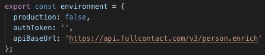

# Social Footprint

Social Footprint allows users to search and discover their online presence. It is backed by an NgRx Store using best practices as described in this article: [Link to article](https://itnext.io/ngrx-best-practices-for-enterprise-angular-applications-6f00bcdf36d7)

#### Note - The primary goal of this repo is for teaching myself NgRx. At it's current stage of development, I have a working template for a 'Social Search Site' backed by an NgRx Store that can be forked and repurposed by anyone interested. 

Subsequently, if you choose to clone/fork this repo and utilize the FullContact API, you will need to obtain an [API key here.](https://www.fullcontact.com/developer/enrich-api/)

In environment.ts, provide your own API Key as the authToken -

`P.S.`- I would not suggest storing your API Key in a public repository.

This project was generated with [Angular CLI](https://github.com/angular/angular-cli) version 7.3.3.

## Development server

Run `ng serve` for a dev server. Navigate to `http://localhost:4200/`. The app will automatically reload if you change any of the source files.

## Build

Run `ng build` to build the project. The build artifacts will be stored in the `dist/` directory. Use the `--prod` flag for a production build.

## Contributions Welcome

Feel free to create a pull request if you like! Although, you might prefer to fork this 'template' and create your own custom social search site.